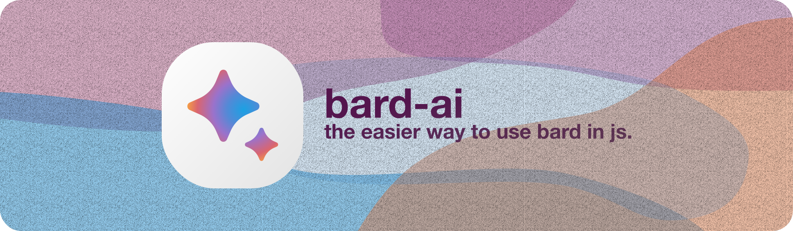

<picture>
  <source media="(prefers-color-scheme: dark)" srcset="./assets/banner@dark.svg">
  <source media="(prefers-color-scheme: light)" srcset="./assets/banner@light.svg">
  
</picture>

# Welcome to `bardAI` Docs

Powered by [Google Bard](https://bard.google.com/), and hosted by [Vercel](vercel.com).

Visit `bardie` on GitHub here: https://github.com/rizzlogy/BardAI

Visit `bardie` on NPM here: https://www.npmjs.com/package/bardie
